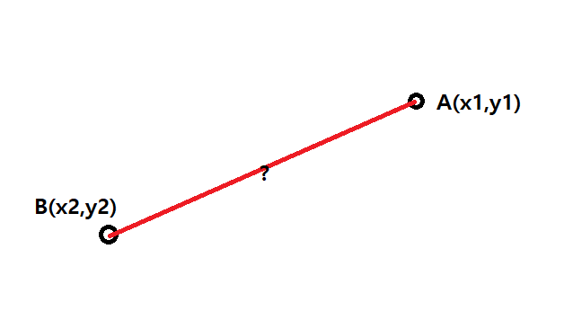
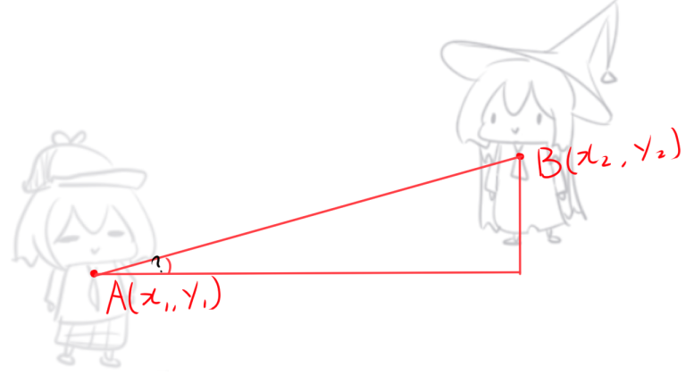
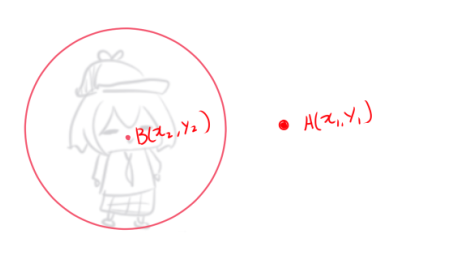
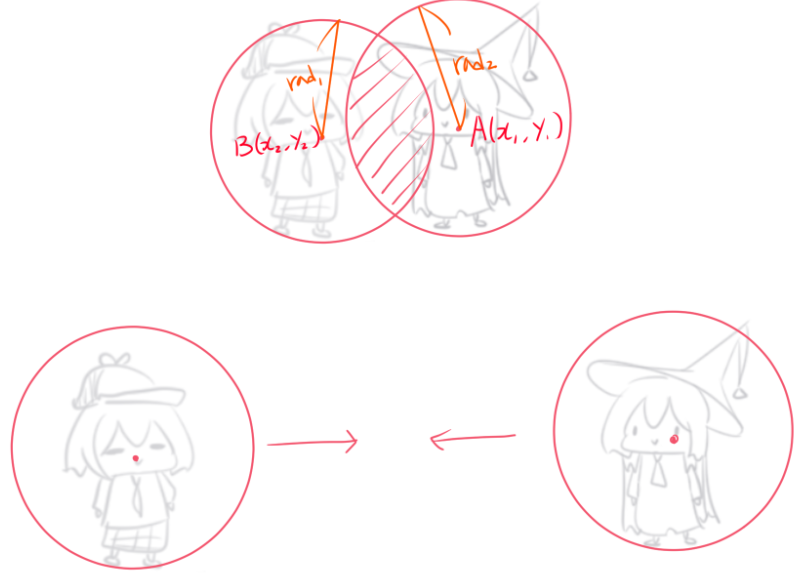

# math_function


## What is this?

It is including some of **useful math functions** & it makes you can use **sin, cos, tan, abs, power, floor**... functions without **"Math."**

-------------

## How to use?

At first, define below code and check the below functions

```
<script src = "https://cdn.jsdelivr.net/gh/ABER1047/math_function@main/scripts.js"></script>
```

### point_distance(x1,y1,x2,y2)

-------------



This function returns the length of a vector formed by the specified components [x1,y1] and [x2,y2]

you can use this function when you want to get distance between two points

</br>


### point_direction(x1,y1,x2,y2)

-------------



This function returns the direction of a vector formed by the specified components [x1,y1] and [x2,y2]

</br>


### place_meeting_point(x1,y1,x2,y2,rad)

-------------



This function returns "true" when a point met or be inside a circle


</br>


### place_meeting_circle(x1,y1,x2,y2,rad1,rad2)

-------------



This function returns "true" when two circles(collision mask) met


</br>


### irandom_range(range_1,range_2)

-------------

You supply the low value for the range as well as the high value, and the function will return a random integer value within (and including) the given range. For example, irandom_range(10, 35) will return an integer between 10 and 35 inclusive.
